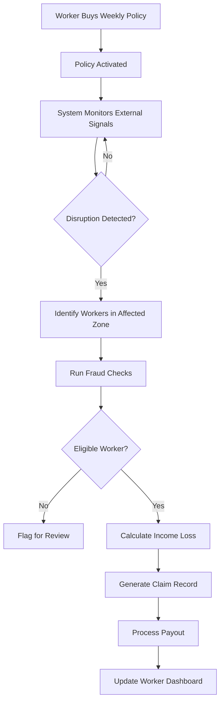
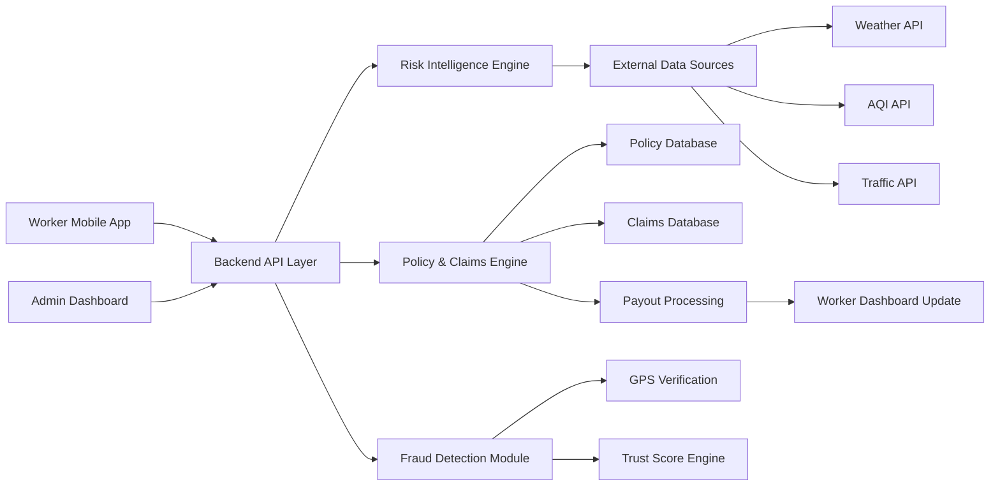
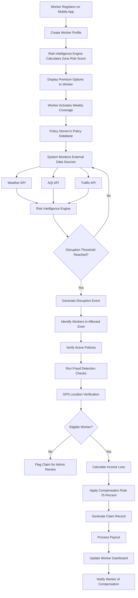

# Smart Gig Insurance Platform
## AI-Powered Parametric Income Protection for Delivery Workers

---

## ⚡ The Reality

A delivery worker starts his day expecting ₹800.

By 2 PM, heavy rain hits. Roads flood. Orders stop.

By night, he earns ₹0.

No fault. No safety net.

Just lost income.

---
## ⚡ Problem → Solution

India’s gig workers depend on daily earnings, but external disruptions like:
- heavy rain  
- pollution spikes  
- traffic breakdowns  

can instantly eliminate their income.

Traditional insurance does not cover **lost working hours** and relies on slow, manual claims — making it ineffective for gig workers.

---

### 💡 Our Solution

We built a **parametric income insurance platform** that provides **short-term (weekly) coverage** for delivery workers.

The system continuously monitors:
- weather conditions  
- air quality (AQI)  
- traffic patterns  

When disruption thresholds are crossed:
- affected workers are automatically identified  
- income loss is calculated  
- payouts are triggered instantly  

👉 No claims. No delays. Just real-time income protection.

---

## 🔗 Detailed Documentation

For deeper technical insights into our system design and implementation:

### 🏛️ Architecture & System Design
- [🏛️ Architecture Overview](./docs/architecture.md)
- [🧩 System Architecture](./docs/system-architecture.md)
- [🗂️ Database Schema](./docs/database-schema.md)

### 🔌 Backend & APIs
- [🔗 API Reference](./docs/api-reference.md)

### 🧠 Intelligence Layer
- [🧠 AI Risk Model](./docs/ai-risk-model.md)
- [🚨 Fraud Detection](./docs/fraud-detection.md)

### ✨ Product Details
- [✨ Product Features](./docs/product-features.md)

---

## 3. Target Worker Persona

The platform focuses on **urban delivery workers**, particularly those operating in food or quick-commerce delivery networks.

A typical worker:

- Works **8–10 hours per day**
- Earns **₹700–₹1000 daily**
- Relies heavily on **weather conditions and city mobility**

### Example Scenario

A worker begins the day expecting a normal earning cycle.

Mid-shift, a **heavy rainstorm** begins and traffic slows across the delivery zone. Orders drop, roads flood, and deliveries become difficult or unsafe.

Instead of losing those hours completely, the system detects the disruption and automatically calculates a compensation amount based on the worker’s expected earnings.

This ensures that **temporary disruptions do not completely eliminate a day’s income**.

---

## 4. Product Overview

The platform is structured around three core components.

### Worker Application

Used by delivery workers to:

- register and authenticate
- view coverage
- track earnings protection
- monitor claims and payouts

### Risk Intelligence Engine

Processes external signals such as:

- weather data
- pollution data
- traffic patterns

These signals help detect disruptions and estimate zone risk.

### Admin & Analytics Dashboard

Used for:

- monitoring system activity
- tracking disruption events
- viewing policies and payouts
- identifying fraud alerts

Together these components form a system where **income protection becomes automatic, transparent, and data-driven**.

---

## 5. Key Features

The platform is designed to provide **real-time income protection for gig workers** through intelligent automation.

- **📅 Weekly Coverage Model**  
  Short-term insurance aligned with gig earning cycles  

- **📊 Expected Earnings Predictor**  
  Estimates worker income based on activity patterns  

- **📉 Income Drop Detection**  
  Identifies sudden earning disruptions  

- **🗺️ Local Risk Heatmap**  
  Visualizes high-risk delivery zones  

- **💰 Dynamic Premium Pricing**  
  Adjusts pricing based on zone risk score  

- **⚡ Smart Claim Automation**  
  Automatically triggers payouts during disruptions  

- **📈 Income Protection Tracker**  
  Displays protected vs lost income in real-time  
---

## 6. Risk & Premium Model

Insurance coverage is based on a **risk scoring system**.

The system analyzes:

- weather patterns
- pollution levels
- traffic congestion
- historical disruptions

### Risk Score Model

| Risk Score | Coverage Tier | Weekly Premium |
|------------|--------------|---------------|
| Low Risk | Basic | ₹15 |
| Medium Risk | Standard | ₹25 |
| High Risk | Extended | ₹35 |

Higher-risk zones offer **greater coverage limits**.

---

## 7. Parametric Claim Automation

The system monitors disruption indicators such as:

- heavy rainfall
- extreme pollution
- severe traffic congestion
- restricted mobility

When a disruption occurs the system executes:

1. Detect disruption event  
2. Identify affected workers  
3. Run fraud validation  
4. Calculate income loss  
5. Generate claim & process payout

   
### Automated Claim Processing Flow

---

## 8. Fraud Detection

The platform ensures secure payouts through multiple validation layers:

- GPS location verification  
- duplicate claim prevention  
- delivery activity validation  
- behavioral anomaly detection  
- worker trust scoring
  
---

## 🚨 Adversarial Defense & Anti-Spoofing Strategy  (Market Crash Response)

To counter advanced GPS spoofing attacks and coordinated fraud rings, our platform uses a **multi-layered verification system beyond basic location checks**.

- **Behavioral Analysis:** Detects real movement patterns vs spoofed/static signals  
- **Multi-Signal Validation:** Combines GPS, device, and network intelligence  
- **Fraud Ring Detection:** Identifies clustered and synchronized claim activity  
- **Fair UX Handling:** Flags suspicious claims without penalizing genuine workers  

👉 [View Detailed Anti-Spoofing Strategy](./docs/anti-spoofing.md)

---

## 9. System Architecture

The system architecture consists of three layers.

### Worker Application

Mobile interface used for:

- registration
- policy activation
- coverage monitoring
- payout tracking

### Backend Processing Engine

Handles:

- disruption detection
- claim automation
- fraud validation
- payout processing

### Admin Dashboard

Provides:

- analytics
- disruption monitoring
- fraud alerts

### System Architecture Diagram

---

## 10. Demo Flow

The demonstration scenario shows the full workflow.

1. Worker registers and creates profile.
2. System calculates zone risk score.
3. Worker activates weekly coverage.
4. Admin simulates disruption event.
5. System detects disruption.
6. Fraud checks verify worker eligibility.
7. Payout is calculated automatically.
8. Worker dashboard updates with claim record.

---

## 11. End-to-End System Workflow

The diagram below illustrates the full lifecycle of the platform — from worker onboarding to automated disruption payouts.

---
## 12. Technology Stack

Our platform uses a modular architecture designed for **real-time disruption detection, automated claim processing, and scalable deployment**.

---

### 🧩 Backend & Processing

- **Python + FastAPI**  
  Core backend framework handling APIs, policy lifecycle, and claim automation  

- **Celery + Redis**  
  Asynchronous processing for:
  - disruption monitoring  
  - bulk claim evaluation  
  - payout processing  

---

### 🗂️ Data & Geospatial Layer

- **PostgreSQL**  
  Stores workers, policies, and claims data  

- **PostGIS**  
  Enables geospatial intelligence:
  - worker location validation  
  - disruption zone mapping  
  - proximity queries  

Example: ST_DWithin(worker_location, disruption_zone, 10000)

---

### 🧠 Risk Intelligence Engine

- Processes environmental and historical data:
  - rainfall intensity  
  - AQI levels  
  - traffic congestion  

- Generates **zone risk scores** used for:
  - premium calculation  
  - disruption detection  

- Built using:
  - rule-based models (MVP)  
  - extensible ML pipeline (future-ready)  

---

### 🌐 External Integrations

| Service | Purpose |
|--------|--------|
| OpenWeatherMap | Weather & rainfall detection |
| AQICN API | Air quality monitoring |
| Google Maps API | Traffic congestion analysis |
| Razorpay Sandbox | Simulated payout processing |

---

### 🛡️ Fraud & Trust Layer

- **Geo-spatial validation (PostGIS)**  
- **Behavioral anomaly detection**  
- **Worker trust score system**  

Supports:
- duplicate claim detection  
- abnormal activity tracking  
- coordinated fraud identification  

---

### 📱 Frontend Interfaces

**Worker Application (WebView-Based Mobile App)**

- Web app wrapped using **Android WebView**
- Enables rapid development + Play Store deployment  
- Ensures consistent UI across devices  

Tech:
- React / Next.js  
- Android Studio (WebView wrapper)  
- REST API integration  

---

**Admin Dashboard (Web Application)**

- Built using React / Next.js  
- Provides analytics, monitoring, and disruption simulation  

---

### 🔐 Security & Authentication

- JWT-based authentication  
- OTP login for workers  
- Role-based access control  
- API validation & request security  

---

### 🚀 Deployment & DevOps

- Docker (containerized backend)  
- Cloud hosting (AWS / Render / Railway)  
- PostgreSQL hosting (Supabase / AWS RDS)  
- GitHub for version control  
---
