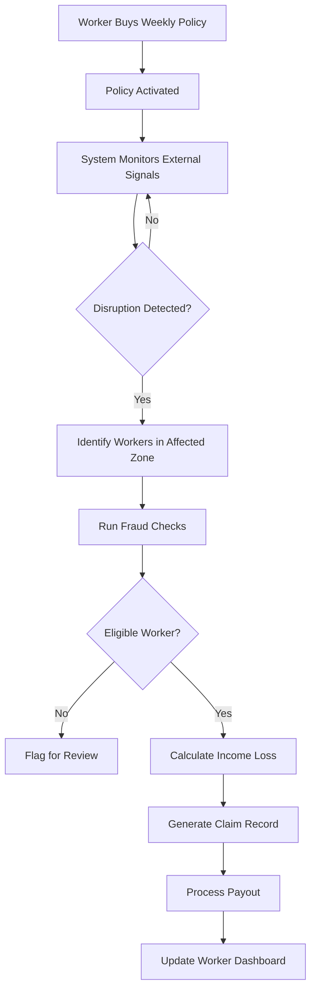
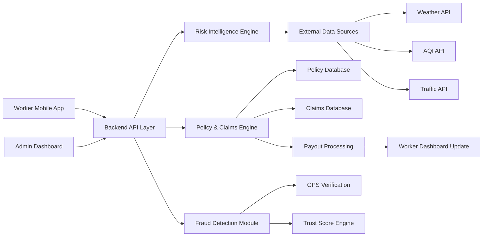
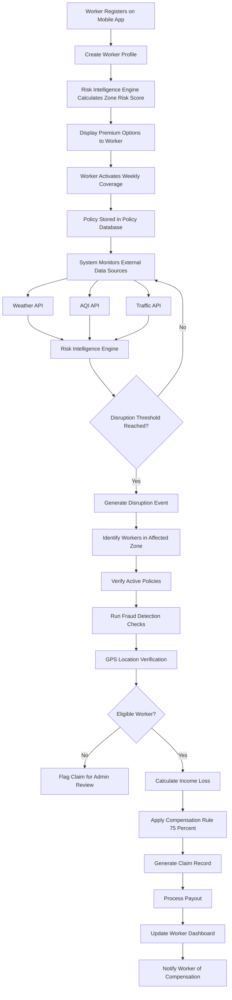

# Smart Gig Insurance Platform
## AI-Powered Parametric Income Protection for Delivery Workers

---

## 1. Problem & Context

India’s gig economy runs on delivery workers who earn daily through platforms like food delivery, grocery delivery, and e-commerce logistics. Their income is highly dependent on external conditions — weather, pollution, local disruptions, and city-level mobility issues.

When extreme rain floods streets, when AQI becomes hazardous, or when sudden restrictions affect mobility, deliveries slow down or stop completely. During these hours the worker simply earns nothing.

Traditional insurance products are not designed for this problem. They insure assets like vehicles or health, but they do not insure lost working hours. Claims are slow, require manual proof, and rarely match the short income cycles of gig workers.

This project explores a different approach: **parametric income insurance**, where payouts are automatically triggered when measurable external disruptions occur.

Instead of proving a loss, the system detects disruption signals and compensates workers based on the hours they could not work.

---

## 2. Our Idea

The platform provides **short-term parametric insurance** designed specifically for delivery workers.

Workers can activate a **weekly coverage policy** that protects their expected income when external disruptions occur in their operating zone.

The system continuously monitors environmental and mobility signals such as:

- weather intensity
- pollution levels
- traffic slowdowns

When these signals cross defined disruption thresholds, the platform automatically evaluates affected workers and calculates compensation.

### Objectives

1. Protect gig workers from unpredictable income loss.
2. Remove manual claim processes.
3. Provide transparent, affordable weekly protection.

This model shifts insurance from **claim-based verification to event-based automation**.

---

## 3. Target Worker Persona

The platform focuses on **urban delivery workers**, particularly those operating in food or quick-commerce delivery networks.

A typical worker:

- Works **8–10 hours per day**
- Earns **₹700–₹1000 daily**
- Relies heavily on **weather conditions and city mobility**

### Example Scenario

A worker begins the day expecting a normal earning cycle.

Mid-shift, a **heavy rainstorm** begins and traffic slows across the delivery zone. Orders drop, roads flood, and deliveries become difficult or unsafe.

Instead of losing those hours completely, the system detects the disruption and automatically calculates a compensation amount based on the worker’s expected earnings.

This ensures that **temporary disruptions do not completely eliminate a day’s income**.

---

## 4. Product Overview

The platform is structured around three core components.

### Worker Application

Used by delivery workers to:

- register and authenticate
- view coverage
- track earnings protection
- monitor claims and payouts

### Risk Intelligence Engine

Processes external signals such as:

- weather data
- pollution data
- traffic patterns

These signals help detect disruptions and estimate zone risk.

### Admin & Analytics Dashboard

Used for:

- monitoring system activity
- tracking disruption events
- viewing policies and payouts
- identifying fraud alerts

Together these components form a system where **income protection becomes automatic, transparent, and data-driven**.

---

## 5. Technology Stack

The platform uses a modular architecture combining backend services, geospatial databases, external data integrations, and automated claim processing systems.

The goal of the technology stack is to support **real-time disruption monitoring, automated parametric payouts, and scalable gig worker coverage.**

---

### Backend Services

The backend layer manages the core system logic including policy management, disruption detection, claim automation, and fraud detection.

Technologies used:

- **Python** – primary backend language used for system logic and risk calculations.
- **FastAPI** – modern high-performance API framework used to build REST APIs.
- **Celery / Background Workers** – handles asynchronous tasks such as disruption monitoring and claim evaluation.
- **Redis** – message broker for background job queues.

Backend services are responsible for:

- worker authentication
- policy lifecycle management
- disruption detection
- automated claim generation
- payout calculation
- fraud validation

---

### Database Layer

The platform uses a relational database designed for geospatial data processing.

Technologies used:

- **PostgreSQL** – primary relational database.
- **PostGIS** – geospatial extension for PostgreSQL.

PostGIS enables advanced spatial queries such as:

- identifying workers inside disruption zones
- validating worker GPS coordinates
- calculating geographic proximity between workers and disruption events

Example spatial query:

```
ST_DWithin(worker_location, disruption_zone, 10000)
```

This query checks whether a worker is located within a **10 km disruption zone radius**.

---

### Risk Intelligence Engine

The risk intelligence engine analyzes environmental signals to determine disruption probability and worker risk scores.

Technologies used:

- **Python data processing modules**
- **rule-based scoring models**
- optional **machine learning extensions**

Inputs analyzed by the engine include:

- rainfall intensity
- air quality index (AQI)
- traffic congestion
- historical disruption patterns

These inputs generate a **zone risk score**, which determines the worker’s premium tier.

---

### External Data APIs

The platform relies on real-world data signals to detect disruptions affecting gig workers.

External APIs include:

| API | Purpose |
|----|----|
| **OpenWeatherMap API** | Detect rainfall, storms, and extreme temperatures |
| **AQICN API** | Monitor air pollution levels |
| **Google Maps Traffic API** | Detect traffic congestion and mobility slowdowns |
| **Razorpay Sandbox API** | Simulate worker payout transactions |

During development and hackathon demonstrations, these APIs can be **mocked to simulate disruption events**.

---

### Fraud Detection Module

The fraud detection system ensures automated payouts remain secure.

Technologies used:

- **PostGIS spatial validation** for location verification
- **rule-based anomaly detection**
- **worker trust score system**

Fraud checks include:

- GPS validation within disruption zones
- duplicate claim detection
- abnormal claim frequency detection
- trust score evaluation

---

### Frontend Interfaces

Two primary user interfaces interact with the platform.

**Worker Mobile Application**

Allows workers to:

- register and authenticate
- activate weekly insurance coverage
- monitor disruption alerts
- track claims and payouts
- view income protection status

Possible technologies:

- React Native (mobile framework)
- REST API integration with backend services

**Admin Dashboard**

Provides administrative control and analytics including:

- disruption monitoring
- claim tracking
- payout analytics
- fraud alerts

Possible technologies:

- React / Next.js
- data visualization libraries

---

### Security & Authentication

Security measures ensure safe access to the platform.

Technologies used:

- **JWT Authentication** for secure API access
- **OTP login verification** for worker authentication
- **Role-based access control** for admin operations
- **API request validation**

These mechanisms protect both worker data and financial transactions.

---

### DevOps & Deployment (Prototype)

For hackathon demonstration purposes, the platform can be deployed using lightweight cloud infrastructure.

Possible deployment tools include:

- **Docker** – containerized backend deployment
- **AWS / Render / Railway** – backend hosting
- **GitHub** – version control and documentation
- **Cloud database hosting (Supabase / AWS RDS)**

This infrastructure allows the system to scale as the number of workers and disruption events increases.
---

## 6. Key Features

The system introduces features designed specifically for gig worker income protection.

### Shift-Based / Weekly Coverage

Workers activate short-term insurance aligned with their working cycle.

### Expected Earnings Predictor

Estimates potential income based on working hours and historical activity.

### Income Drop Detector

Detects sudden earning drops during disruptions.

### Local Risk Heatmap

Displays disruption risk across delivery zones.

### Dynamic Premium Pricing

Premiums adjust based on zone risk level.

### Smart Claim Automation

Claims are triggered automatically when disruption thresholds are reached.

### Worker Trust Score

Maintains credibility metrics for each worker.

### Fraud Detection Mechanisms

Detects suspicious activity patterns.

### Income Protection Meter

Shows workers how much income has been protected.

### Emergency Payout Trigger

Allows instant payouts during severe disruptions.

---

## 7. Risk & Premium Model

Insurance coverage is based on a **risk scoring system**.

The system analyzes:

- weather patterns
- pollution levels
- traffic congestion
- historical disruptions

### Risk Score Model

| Risk Score | Coverage Tier | Weekly Premium |
|------------|--------------|---------------|
| Low Risk | Basic | ₹15 |
| Medium Risk | Standard | ₹25 |
| High Risk | Extended | ₹35 |

Higher-risk zones offer **greater coverage limits**.

---

## 8. Parametric Claim Automation

The system monitors disruption indicators such as:

- heavy rainfall
- extreme pollution
- severe traffic congestion
- restricted mobility

When a disruption occurs the system executes:

1. Detect disruption event.
2. Identify active policies in the affected zone.
3. Verify worker eligibility.
4. Calculate payout based on hourly earnings.
5. Record payout and update claim history.

### Automated Claim Processing Flow



---

## 9. Fraud Detection

The system includes several safeguards.

### GPS Location Verification

Ensures the worker was inside the affected zone.

### Duplicate Claim Prevention

Prevents multiple claims for the same disruption.

### Delivery Activity Validation

Confirms the worker was active during the disruption.

### Behavioral Anomaly Detection

Detects unusual activity patterns.

### Worker Trust Score

Adjusts system confidence based on worker reliability.

---

## 10. System Architecture

The system architecture consists of three layers.

### Worker Application

Mobile interface used for:

- registration
- policy activation
- coverage monitoring
- payout tracking

### Backend Processing Engine

Handles:

- disruption detection
- claim automation
- fraud validation
- payout processing

### Admin Dashboard

Provides:

- analytics
- disruption monitoring
- fraud alerts

### System Architecture Diagram



---

## 11. Demo Flow

The demonstration scenario shows the full workflow.

1. Worker registers and creates profile.
2. System calculates zone risk score.
3. Worker activates weekly coverage.
4. Admin simulates disruption event.
5. System detects disruption.
6. Fraud checks verify worker eligibility.
7. Payout is calculated automatically.
8. Worker dashboard updates with claim record.

### What This Demonstrates

The complete automated insurance cycle:

1. Worker activates coverage  
2. System monitors disruption signals  
3. Disruption occurs  
4. Eligible workers identified  
5. Fraud checks executed  
6. Payout calculated  
7. Worker receives automated update

---

## 12. End-to-End System Workflow

The diagram below illustrates the full lifecycle of the platform — from worker onboarding to automated disruption payouts.


