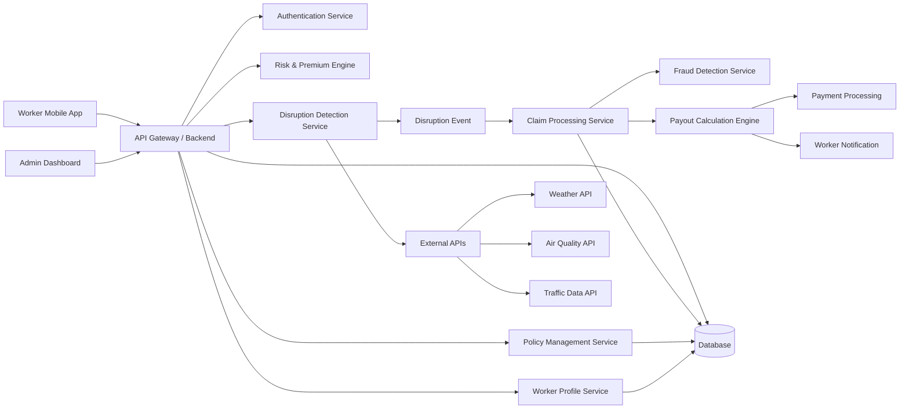
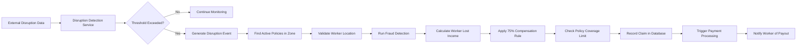

# Service Structure

The platform follows a modular service-based architecture where each service is responsible for a specific functionality.  
This separation ensures scalability, maintainability, and easier future expansion of the platform.

The main services in the system include:

- **Authentication Service**  
  Handles worker authentication using OTP verification and manages secure session tokens.

- **Worker Profile Service**  
  Stores and manages worker information such as platform type, average income, working hours, and location data.

- **Policy Management Service**  
  Creates and manages weekly insurance policies, including policy activation, expiration, and coverage limits.

- **Risk & Premium Engine**  
  Calculates the worker's risk score based on environmental and geographic factors and determines the appropriate premium tier.

- **Disruption Detection Service**  
  Continuously monitors external environmental signals such as weather, pollution, and mobility restrictions.

- **Claim Processing Service**  
  Automatically evaluates disruption events and processes eligible claims.

- **Fraud Detection Service**  
  Validates claims using rules such as GPS validation, duplicate claim checks, and abnormal activity detection.

- **Notification Service**  
  Sends alerts and notifications to workers regarding disruption events, claims, and payouts.

---
### Architecture Diagram

### Core Modules

The platform is organized into several functional modules that encapsulate specific business logic.

Key modules include:

- **User Management Module**  
  Handles worker registration, authentication, and profile management.

- **Policy Management Module**  
  Manages insurance policies including policy creation, activation, and coverage tracking.

- **Risk Analysis Module**  
  Calculates worker risk scores and determines premium tiers.

- **Disruption Monitoring Module**  
  Tracks environmental disruptions using external data sources.

- **Claim Processing Module**  
  Evaluates disruption events and calculates eligible compensation.

- **Fraud Detection Module**  
  Identifies suspicious claims and prevents system abuse.

- **Notification Module**  
  Sends system notifications related to policies, claims, and payouts.

Each module interacts with others through defined service interfaces and APIs.

---

### Event Pipelines

The platform uses an event-driven architecture to automate disruption detection and claim processing.

Event pipelines allow the system to process real-world disruption events asynchronously and trigger automated workflows.

The main event pipelines include:

- **Disruption Event Pipeline**  
  Detects environmental disruptions from external data sources.

- **Claim Processing Pipeline**  
  Processes claims automatically when disruption events occur.
  

- **Fraud Detection Pipeline**  
  Validates claims before payouts are approved.

- **Notification Pipeline**  
  Sends alerts and updates to workers regarding disruptions and payouts.

Event-driven processing ensures that the system can handle large numbers of workers and disruption events efficiently.

---

### Disruption Detection Flow

The system continuously monitors environmental and mobility data to identify disruptions that may affect gig workers.

The disruption detection process follows these steps:

1. External APIs provide environmental and mobility data such as weather conditions, pollution levels, and traffic congestion.
2. Worker Processing Services monitor these data streams at regular intervals.
3. The system checks whether predefined disruption thresholds are exceeded.
4. If a threshold is exceeded, a **disruption event** is generated.
5. The disruption event is sent to the **Claim Processing Pipeline** for evaluation.

This automated monitoring ensures that disruption events are detected quickly and consistently.

---

### Claim Automation Pipeline

Once a disruption event is detected, the system automatically processes claims for eligible workers.

The claim automation pipeline performs the following steps:

1. Identify geographic zones affected by the disruption event.
2. Retrieve workers with active policies within the affected zone.
3. Validate worker eligibility based on policy status and location data.
4. Run fraud detection checks to prevent suspicious claims.
5. Calculate payout amounts based on worker income and disruption duration.
6. Record the claim in the system database.
7. Trigger payment processing and notify the worker.

This automated process ensures that workers receive compensation quickly without needing to manually submit claims.

