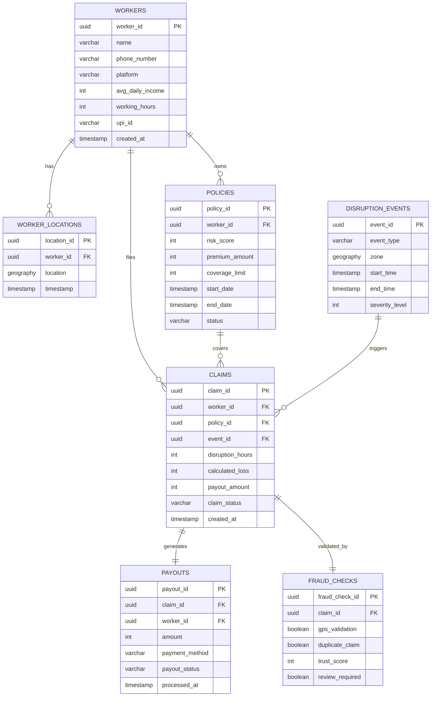

## Database Schema

This document describes the database design used in the **AI-Powered Parametric Insurance Platform for Gig Workers**.

The system uses **PostgreSQL** as the primary database with the **PostGIS extension** for geospatial data handling. This enables efficient storage and querying of worker locations and disruption zones.

The schema supports:

- Worker registration and profile management
- Insurance policy management
- Disruption event monitoring
- Automated claim generation
- Fraud detection validation
- Payout processing

---

### Tables Overview

The primary tables used in the system include:

| Table Name | Purpose |
|-----------|--------|
| workers | Stores worker profile and identity information |
| worker_locations | Stores location history and geospatial data |
| policies | Tracks insurance policies purchased by workers |
| disruption_events | Stores detected disruption events |
| claims | Stores claim records generated by disruption events |
| payouts | Tracks payout transactions |
| fraud_checks | Stores fraud detection results |

---

### Workers Table

Stores basic information of registered workers.

| Column | Type | Description |
|------|------|-------------|
| worker_id | UUID (PK) | Unique identifier for each worker |
| name | VARCHAR | Worker name |
| phone_number | VARCHAR | Registered phone number |
| platform | VARCHAR | Delivery platform (Swiggy, Zomato, etc.) |
| avg_daily_income | INTEGER | Average daily income |
| working_hours | INTEGER | Average working hours per day |
| upi_id | VARCHAR | UPI ID for payout processing |
| created_at | TIMESTAMP | Worker registration timestamp |

---

### Worker Locations Table

Stores worker location data using **PostGIS geospatial types**.

| Column | Type | Description |
|------|------|-------------|
| location_id | UUID (PK) | Unique location record |
| worker_id | UUID (FK) | Reference to workers table |
| location | GEOGRAPHY(Point) | Worker GPS coordinates |
| timestamp | TIMESTAMP | Time of location ping |

Using PostGIS enables spatial queries such as detecting workers within disruption zones.

**Example spatial query:**

SELECT worker_id
FROM worker_locations
WHERE ST_DWithin(location, disruption_zone, 10000);

This query finds workers within a **10 km radius** of a disruption event.

---

### Policies Table

Tracks insurance policies purchased by workers.

| Column | Type | Description |
|------|------|-------------|
| policy_id | UUID (PK) | Unique policy identifier |
| worker_id | UUID (FK) | Worker owning the policy |
| risk_score | INTEGER | Risk score assigned to worker |
| premium_amount | INTEGER | Weekly premium amount |
| coverage_limit | INTEGER | Maximum payout allowed |
| start_date | TIMESTAMP | Policy start date |
| end_date | TIMESTAMP | Policy expiration date |
| status | VARCHAR | Policy status (active / expired) |

Policies are structured on a **weekly basis** to match the earnings cycle of gig workers.

---

### Disruption Events Table

Stores environmental disruption events detected by the system.

| Column | Type | Description |
|------|------|-------------|
| event_id | UUID (PK) | Unique disruption event ID |
| event_type | VARCHAR | Type of disruption (rain, heatwave, pollution) |
| zone | GEOGRAPHY(Polygon) | Geographic region affected |
| start_time | TIMESTAMP | Event start time |
| end_time | TIMESTAMP | Event end time |
| severity_level | INTEGER | Severity of disruption |

These events trigger the **claim automation pipeline**.

---

### Claims Table

Stores claims generated automatically when disruption events occur.

| Column | Type | Description |
|------|------|-------------|
| claim_id | UUID (PK) | Unique claim identifier |
| worker_id | UUID (FK) | Worker receiving compensation |
| policy_id | UUID (FK) | Policy associated with claim |
| event_id | UUID (FK) | Disruption event triggering claim |
| disruption_hours | INTEGER | Duration of disruption |
| calculated_loss | INTEGER | Estimated lost income |
| payout_amount | INTEGER | Final payout value |
| claim_status | VARCHAR | Claim status (approved / rejected / pending) |
| created_at | TIMESTAMP | Claim creation timestamp |

Claims are generated automatically by the **claim processing service**.

---

### Payouts Table

Stores payout transactions sent to workers.

| Column | Type | Description |
|------|------|-------------|
| payout_id | UUID (PK) | Unique payout identifier |
| claim_id | UUID (FK) | Associated claim |
| worker_id | UUID (FK) | Worker receiving payout |
| amount | INTEGER | Amount paid |
| payment_method | VARCHAR | Payment method (UPI / wallet) |
| payout_status | VARCHAR | Payment status |
| processed_at | TIMESTAMP | Timestamp of payout |

---

### Fraud Checks Table

Stores fraud detection results for claim validation.

| Column | Type | Description |
|------|------|-------------|
| fraud_check_id | UUID (PK) | Unique fraud check identifier |
| claim_id | UUID (FK) | Associated claim |
| gps_validation | BOOLEAN | Worker location validation result |
| duplicate_claim | BOOLEAN | Duplicate claim detection |
| trust_score | INTEGER | Risk score assigned by fraud system |
| review_required | BOOLEAN | Indicates if manual review is required |

---

### Relationships Between Tables

The database follows a relational structure with the following key relationships:

- **workers → policies** (one-to-many)
- **workers → worker_locations** (one-to-many)
- **policies → claims** (one-to-many)
- **disruption_events → claims** (one-to-many)
- **claims → payouts** (one-to-one)
- **claims → fraud_checks** (one-to-one)

These relationships ensure that each disruption event can trigger claims for multiple workers while maintaining proper data integrity.

---
### Entity Relationship Diagram

---
### Data Storage Logic

The system stores data in a structured way to support automated claim processing.

#### Worker Data

Worker profiles are stored in the `workers` table and linked to policies and claims through foreign keys.

#### Location Data

Worker GPS data is stored in the `worker_locations` table using **PostGIS geography points** for efficient spatial queries.

#### Disruption Events

Environmental data from external APIs is converted into disruption events and stored in the `disruption_events` table.

#### Claims

When a disruption event affects workers with active policies, the system automatically generates claim records.

#### Payouts

Approved claims generate payout records which are processed through payment services.

---

### Geolocation Storage

Geospatial data is stored using **PostGIS geography types**.

This enables the system to:

- Identify workers within disruption zones
- Validate worker GPS location for fraud detection
- Detect suspicious location behavior

A spatial index is used to improve query performance.

**Example index:**

CREATE INDEX idx_worker_location
ON worker_locations
USING GIST(location);

---

### Claim Tracking Logic

Claim tracking follows the automated **parametric insurance model**.

The process includes:

1. Detect disruption event
2. Identify workers within affected zones
3. Validate active policy status
4. Calculate lost income
5. Apply compensation rules
6. Record claim in database
7. Process payout transaction

This database design ensures efficient tracking of policies, disruption events, claims, and payouts across the system.
