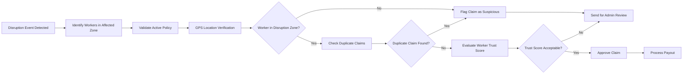

## Fraud Detection System

This document describes the fraud detection mechanisms used in the **AI-Powered Parametric Insurance Platform for Gig Workers**.

Since the platform uses **automated parametric payouts**, fraud prevention is critical to ensure that workers cannot exploit disruption events or submit invalid claims.

The system combines **rule-based validation, location verification, and behavioral analysis** to detect suspicious activity.

---

### Fraud Scenarios

The system is designed to detect and prevent several common fraud scenarios.

Examples include:

- Workers claiming compensation while operating outside the disruption zone
- Attempting to submit multiple claims for the same disruption event
- Manipulating GPS data to appear inside affected areas
- Repeatedly claiming disruptions with abnormal frequency
- Coordinated fraudulent activity across multiple accounts

These scenarios are evaluated automatically before payouts are processed.

---

### GPS Validation

GPS validation ensures that the worker was actually present in the affected area during the disruption event.

The validation process includes:

1. Retrieve the worker's latest location pings.
2. Compare worker coordinates with the disruption zone.
3. Verify that the worker was within the affected area during the disruption timeframe.

Example spatial validation logic:

```
ST_DWithin(worker_location, disruption_zone, 10000)
```

This query checks whether the worker was within **10 km of the disruption zone**.

If the worker location does not match the disruption zone, the claim is flagged as suspicious.

---

### Duplicate Claim Detection

Duplicate claim detection prevents workers from receiving multiple payouts for the same disruption event.

The system checks:

- existing claims for the same worker
- associated disruption event IDs
- policy status

Example validation logic:

```
SELECT COUNT(*)
FROM claims
WHERE worker_id = ?
AND event_id = ?
```

If a claim already exists for the same event, the new claim request is rejected.

---

### Trust Score Logic

Each worker is assigned a **Trust Score** that reflects the reliability of their activity on the platform.

The trust score is calculated based on multiple signals:

- successful claim history
- previous fraud flags
- location validation accuracy
- claim frequency patterns

Example trust score formula:

```
Trust Score =
100
- (Fraud Flags × 20)
- (Duplicate Claims × 25)
- (GPS Mismatch × 15)
```

Workers with low trust scores may experience:

- additional claim verification
- delayed payouts
- manual admin review

---

### Anomaly Detection

The system monitors behavioral patterns to identify abnormal claim activity.

Anomalies may include:

- unusually frequent claims
- claims occurring at unexpected times
- multiple workers claiming identical disruptions from suspicious locations
- inconsistent worker location data

The anomaly detection system analyzes historical claim patterns and flags irregular behavior for review.

---

### Fraud Review Workflow

When a potential fraud case is detected, the system follows this process:

1. Fraud detection rules flag the claim.
2. The claim is marked as **"under review"**.
3. Fraud validation signals are stored in the fraud_checks table.
4. Admins can review suspicious claims from the dashboard.
5. The claim is either **approved or rejected**.

This workflow ensures that legitimate workers receive payouts while preventing fraudulent claims.

---
### Fraud Detection Workflow


---

### Future Improvements

Future improvements to the fraud detection system may include:

- machine learning models for fraud classification
- anomaly detection using historical claim datasets
- device fingerprinting to detect duplicate accounts
- behavioral pattern analysis across worker groups

These enhancements will further strengthen fraud detection accuracy while maintaining fast automated payouts.
