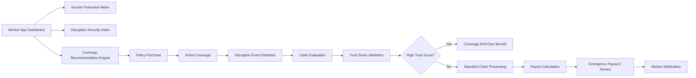

## Product Features

This document outlines the key product features of the **AI-Powered Parametric Insurance Platform for Gig Workers**.

The platform is designed to provide **income protection, disruption awareness, and automated financial safety nets** for gig workers affected by external conditions such as extreme weather or mobility disruptions.

---

### Income Loss Comparison

The platform helps workers understand the financial benefit of insurance by showing a comparison between **protected income and potential loss without insurance**.

This feature estimates the income a worker would lose during disruption events and highlights how much of that loss is covered by the insurance policy.

Example scenario:

| Scenario | Income Impact |
|---|---|
| Without Insurance | Worker loses ₹400 due to disruption |
| With Platform Coverage | Worker receives ₹300 payout (75% compensation) |
| Net Loss After Coverage | ₹100 |

This comparison helps workers clearly understand the **value of having income protection**.

---

### Income Protection Meter 

The **Income Protection Meter** visually displays the worker's level of financial protection.

The meter combines several signals:

- active policy coverage
- disruption risk in the worker's zone
- historical disruption patterns
- compensation coverage percentage

The meter indicates how much of the worker's income is protected.

Example display information:

- weekly coverage limit
- percentage of income protected
- past payouts received
- estimated protected income during disruptions

This helps workers quickly understand their **financial safety level while working**.
---

### Disruption Security Index

The **Disruption Security Index (DSI)** represents the level of protection a worker has against potential disruptions.

The index combines multiple signals such as:

- environmental risk levels
- worker risk score
- policy coverage level
- historical disruption frequency

The DSI helps workers quickly understand how secure their income is in their operating zone.

---

### Coverage Recommendation Engine

The **Coverage Recommendation Engine** suggests the most suitable insurance tier for a worker based on their risk profile.

Recommendations are generated using:

- environmental risk levels
- historical disruption patterns
- worker income level
- geographic operating zone

This helps workers select policies that provide appropriate protection without unnecessary costs.

---

### Shift Coverage

Gig workers often operate during different hours of the day.

The **Shift Coverage** feature ensures that workers are protected during their active working periods.

Coverage evaluation considers:

- worker working hours
- disruption event duration
- overlapping working shifts

If a disruption occurs during a worker’s shift, the system automatically evaluates eligibility for compensation.

---

### Trust Score

Each worker is assigned a **Trust Score** that reflects their reliability and behavior on the platform.

The trust score is influenced by factors such as:

- claim history
- GPS validation accuracy
- fraud detection signals
- account activity consistency

Workers with higher trust scores may receive additional benefits such as faster payouts or extended coverage.

---

### Emergency Payout

In cases of severe disruptions, the platform supports **Emergency Payouts**.

Emergency payouts provide immediate financial support when:

- disruption severity exceeds defined thresholds
- workers are unable to operate for extended periods
- system confidence in disruption impact is high

This feature ensures that workers receive assistance quickly during extreme conditions.

---

### Coverage Roll-Over for High Trust Workers

Workers with consistently high trust scores may benefit from **Coverage Roll-Over**.

If a worker does not use their full coverage during a policy period, a portion of the unused coverage may roll over to the next cycle.

Benefits include:

- increased coverage limits
- improved trust-based rewards
- stronger worker engagement with the platform

This mechanism encourages responsible usage of the system and rewards trustworthy behavior.

---

### Worker Dashboard Experience

All product features are presented through a simplified worker dashboard that includes:

- Income Protection Meter
- Active Policy Status
- Disruption Alerts
- Claim History
- Coverage Recommendations

The dashboard ensures that workers can easily understand their protection status and financial safety at any time.

---

### Product Feature Flow

